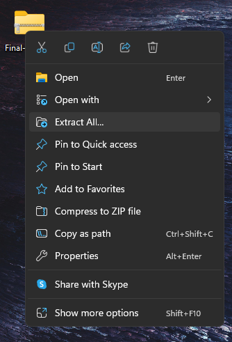
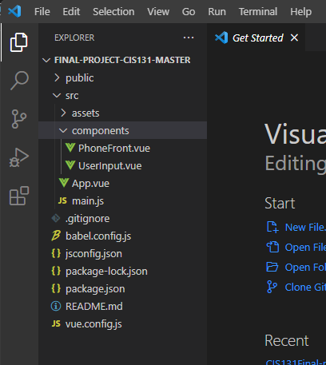
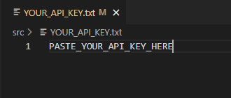

# weatherapp

## To set up the project

### 1) Click the 'Code' button and select 'Download ZIP'


### 2) Find the location of the downloaded file


### 3) Extract all the files/folders from the ZIP


### 4) Note the location (path) of where you extract to


### 5) Open 'Final-Project-CIS131-master' inside your editor


### 6) Find the .txt file 'YOUR_API_KEY' (inside of the 'src' folder) and paste your API key on line 1


### 7) Open a terminal to install the 'node_modules' folder by typing
```
npm install
```

### 8) CONGRATS! You're finally ready to view the file, to finish, type
```
npm run serve
```
